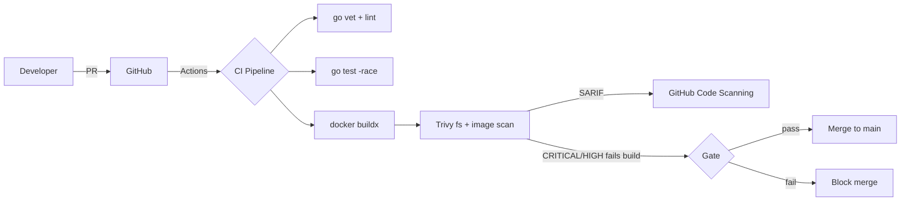

# devsecops-warmup

A tiny Go HTTP service wrapped in the full DevSecOps build pipeline. This repo is the **reusable template** for everything else in the portfolio: hardened container, CI with lint/test/build/scan, branch protection, conventional commits, tagged releases.

[](https://github.com/mohidev-tech/devsecops-warmup/actions/workflows/ci.yml)
[](LICENSE)

## What it is

A 100-line Go service with `/healthz`, `/readyz`, and `/`. Boring on purpose — the *interesting* part is what surrounds it.

## Architecture



## Quickstart

```bash
# Run locally
make run                  # http://localhost:8080

# Test + lint
make test

# Build distroless image
make image

# Scan it
make scan
```

## What the CI proves

- **`go vet` + `golangci-lint`** — static analysis gate.
- **`go test -race`** — unit tests with race detector.
- **Multi-stage build** — final image is `gcr.io/distroless/static-debian12:nonroot`, no shell, no package manager, runs as UID 65532.
- **Trivy filesystem scan** — fails the build on any CRITICAL/HIGH vuln in source/deps.
- **Trivy image scan** — same gate on the built image.
- **SARIF upload** — findings appear in the GitHub Security tab.

## Hardening choices (the why)

| Choice | Why |
|---|---|
| `distroless/static:nonroot` | No shell ↦ no `kubectl exec` shell pop, no `sh`-based RCE chains. Static binary ↦ smallest CVE surface. |
| `CGO_ENABLED=0` + `-trimpath` | Reproducible builds, no glibc dependency, no source paths leaking into binary. |
| `-ldflags="-s -w"` | Strips debug info — smaller binary, less reverse-engineering signal. |
| `ReadHeaderTimeout` set | Mitigates Slowloris. Go's default `http.Server` is dangerous without it. |
| `ignore-unfixed: true` in Trivy | Don't block builds on CVEs upstream hasn't patched yet — but track them. |

## Roadmap

- [ ] Add SBOM generation (`syft`) + attach to releases
- [ ] Sign images with `cosign` (keyless via OIDC)
- [ ] Add SAST (`gosec`) and SCA (`govulncheck`) jobs
- [ ] Helm chart in a sibling repo for deploy stories

## License

Apache 2.0 — see [LICENSE](LICENSE).
